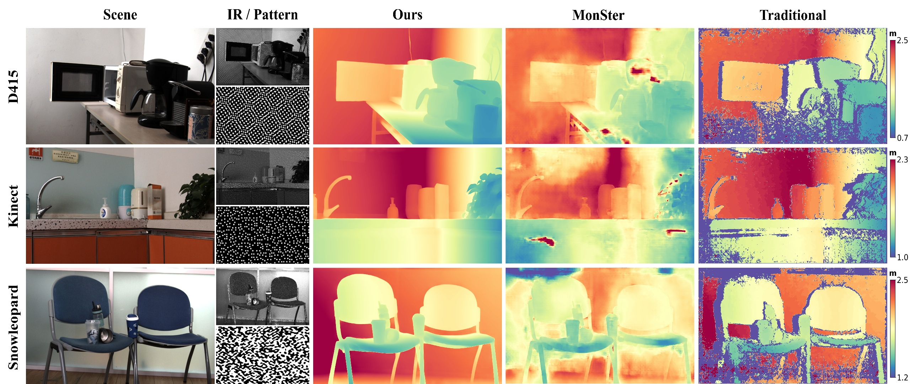

# Neural Structured Light


This repository provides the official implementation of the SIGGRAPH Asia paper *Robust Single-shot Structured Light 3D Imaging via Neural Feature Decoding*.

We introduce **Neural Structured Light**, which moves single-shot structured-light decoding from the fragile **pixel domain** into the **neural feature domain**.  
In addition, we build a large-scale synthetic structured-light dataset using extensive domain randomization.  
Thanks to this, our model — trained **entirely on synthetic data** — achieves good **sim2real generalization**, delivering higher accuracy and better completeness on real-world scenes, while offering better robustness against long-standing challenges such as strong specularities, strong ambient illumination, and translucent materials.

# Dataset
Unfortunately, the original dataset used in the paper was corrupted during an internal cluster migration.  
However, we have open-sourced the full dataset rendering pipeline (see [here](https://github.com/Namisntimpot/NSL_Data)) along with all open assets used to build it:  
**[NSL_Scenes](https://huggingface.co/datasets/slleeepppp/NSL_Scenes)**.

You may re-render the dataset following the instructions in the linked repository.  
Although the re-rendered dataset will not match the original byte-to-byte, it maintains the **same quality**, **diversity**, and **randomness**.

# Models
+ **[Monocular structured-light checkpoint](https://drive.google.com/file/d/1Gh7TyEdGahgdGDbwSXEgVXAbrS4__LYK/view?usp=sharing)**  
  (input: one structured-light camera image + one projected pattern)

+ **[Binocular structured-light checkpoint](https://drive.google.com/file/d/1UCC2g0yzKE-xC8JQ_22fAOr21ic-C0NT/view?usp=sharing)**  
  (input: left + right structured-light camera images)

+ **[Binocular + projector structured-light checkpoint](https://drive.google.com/file/d/1S5woPaqsqxjin84RHIZjzp66stMpw-Vy/view?usp=sharing)**  
  (input: left + right camera images + projector pattern)  
  **Note:** In practice, this model requires *strict trinocular rectification* across left–projector–right. All three optical centers must be collinear — something extremely difficult to achieve with off-the-shelf hardware.  
  **We strongly recommend NOT using this model in real setups until a more practical solution is developed.**  
  <details>
  <summary>(Click to expand) Additional note</summary>
  To run this model you must also pass the extra forward argument `corr_middle_rate`, representing the ratio between (projector–left) baseline and (left–right) baseline after trinocular rectification.
  </details>

Place downloaded weights under `zoo/ckpts/` or any directory you prefer.

# Environment
```
conda create -n nsl python=3.11
conda activate nsl
pip install -r requirement.txt
```

# Inference Example
See the example inference script: `inf.py`.  
**Important:** this script does not perform rectification.  
You must provide **already-rectified images** and **camera parameters**.

### Monocular structured light (left_img + pattern)
```
python inf.py --cfgs cfgs/local/NSL_left-patt.yaml \
    --weight zoo/ckpts/nsl_left-patt.pt \
    --limg example/tearoom/limg_lp.png \
    --patt example/tearoom/patt_lp.png \
    --param example/tearoom/param_lp.npy
```

### Binocular structured light (left_img + right_img)
```
python inf.py --cfgs cfgs/local/NSL_left-right.yaml \
    --weight zoo/ckpts/nsl_left-right.pt \
    --limg example/tearoom/limg_lr.png \
    --rimg example/tearoom/rimg_lr.png \
    --param example/tearoom/param_lr.npy
```
`param.npy` must contain camera parameters in a dictionary, including:
- `L_intri`, `R_intri`, `P_intri`: 3×3 intrinsics of left/right/projector  
- `L_extri`, `R_extri`, `P_extri`: 4×4 extrinsics of left/right/projector  

Missing entries can be filled with any **meaningless placeholder matrix** if unused.

# Acknowledgements
This repository is heavily inspired by the following excellent works — we sincerely thank their authors!

+ [Raft-Stereo](https://github.com/princeton-vl/RAFT-Stereo)  
+ [DepthAnythingV2](https://github.com/DepthAnything/Depth-Anything-V2)  
+ [PromptDA](https://github.com/DepthAnything/PromptDA)